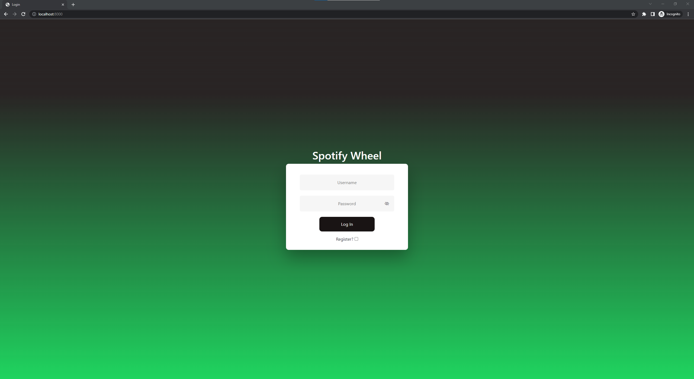
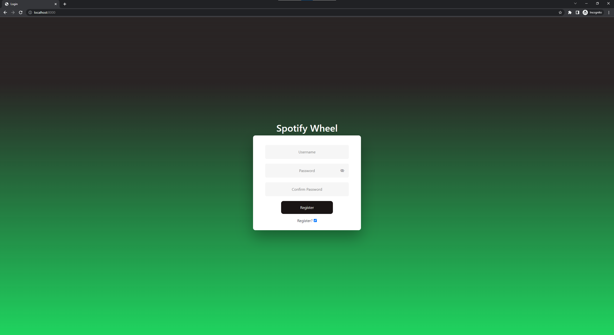
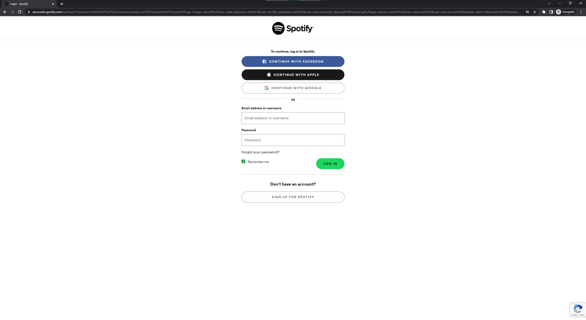
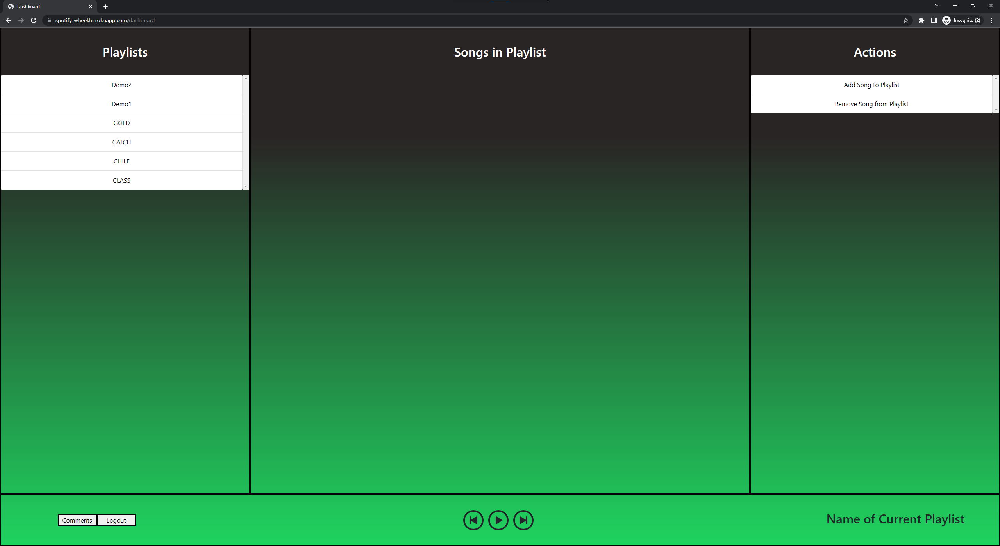
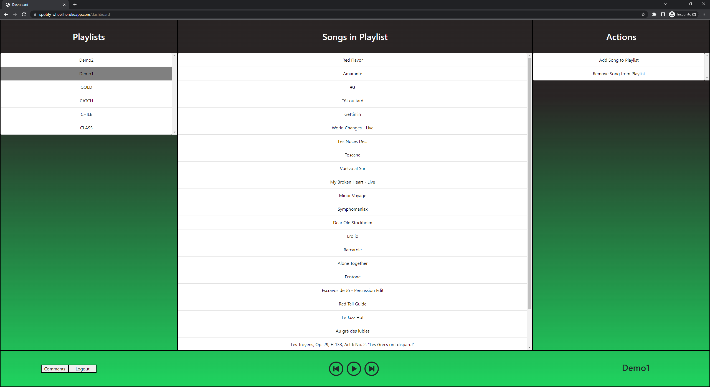
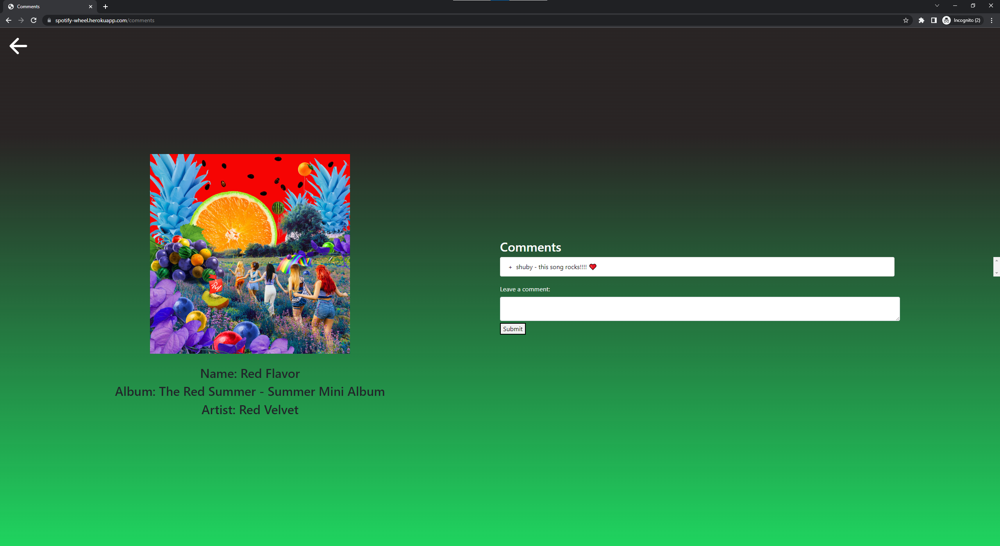
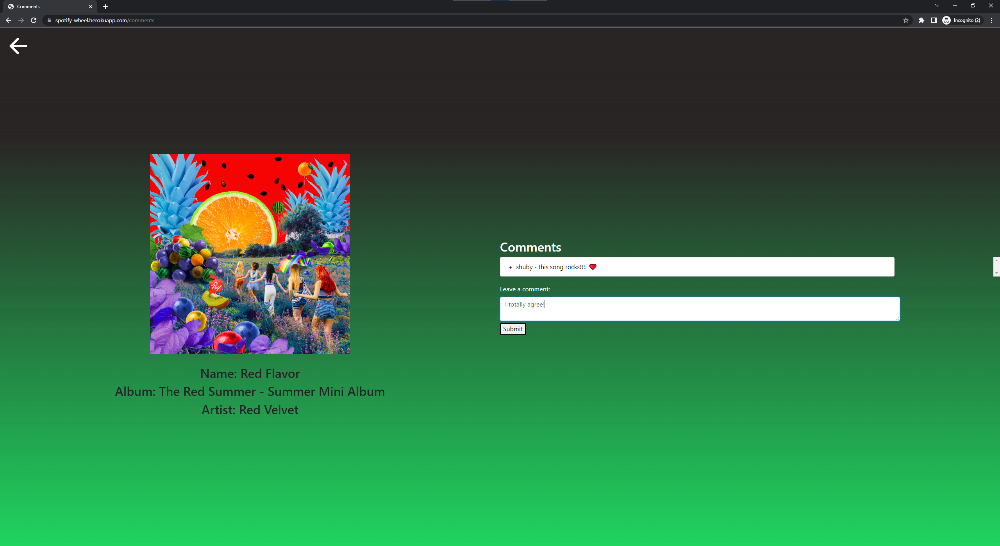
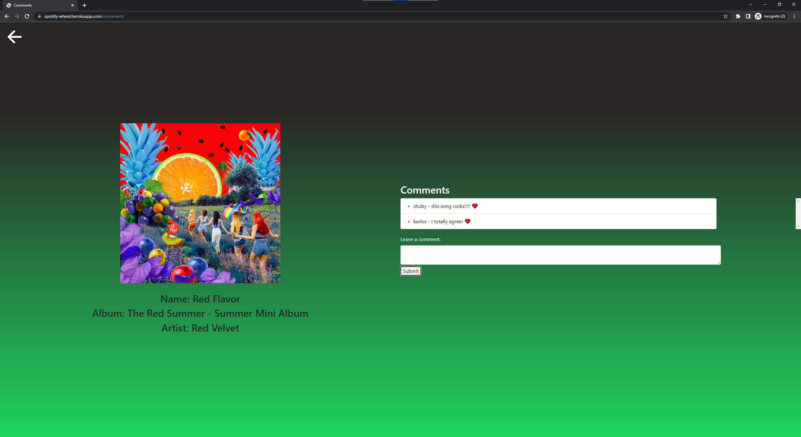

Team Name: Upsilon App name: Spotify wheel Semester: Fall 2022

Overview: Spotify wheel is a webapp that allows users to interface with their spotify account in a new innovative ways. It allows you to manipulate playlists in a more convenient fashion from the current playing song. It also lets you to be able to comment other people's songs and view any reviews left by other users. Our app is innovative because it provides more additions on top of the regular spotify features, giving users more options to interact not only with the app but also other people.

Team Members: Shubhranshu Mishra (ShubyM), Karlos Boehlke (karlosdb), Kevin Nguyen (ktnguy)

User Interface: When first accessing the site, the user is first greeted by our login page. The user has the option to either login with a username/password, or register with a unique username. If logging in for the first time, users will be brought to an OAuth page for connecting to spotify. Once connected, users will have their dashboard displayed. The dashboard contains all playlists your account has on the left column and two options on right, add song to playlist and remove song from playlist. If you click on a playlist, it will bring up the songs in your playlist. Clicking on a song will play it. The selected playlist, and the currently playing song are considered 'focused', and the add/remove buttons on the right will work in respect to this playlist/song combo. In the bottom left, we also have comments and logout. The comments button will bring the user to a comments page for that currently playing song, which will contain the song information such as the album art and artist, along with previously posted comments on that song, and the option to leave your own comment which is linked to your account. Going back to the dashboard and clicking the log out button in the bottom left will log out the user and bring them to the login page.

## Login Page

## Main Dashboard

## Comments Page

So in summary, we have: Login page Register OAuth Dashboard Comments

APIs: We use the "Spotify WebAPI Node" (https://github.com/thelinmichael/spotify-web-api-node) to connect to the user's spotify account.

DATABASE: For our website, we used MongoDB for our database. In our database, we have two collections, users and comments. Users contains account info and comments just contain songs and their comments. More specifically, the users collection stores documents containing a username, hashed password, and a unique salt. The songs collection contains documents containing a song name and a associated list of comments.

APIs/Routing For authentication: Our local strategy is that whenever a user inputs their account info, we perform a check to see if the username first exists. If it does, we check to see if the hashed version + salt of the input password matches the database. If they do match, we know that the user is authenticated.

POST /login: We are using a local strategy. If it passes the local strategy (Successful login), the user will be redirected to the spotify login page. This endpoint just helps us check that.

POST /checkUsername: Checks to see if the username is in the database. If it is, it returns a JSOON with true, otherwise false.

POST /register: Register takes the input username and password and calls the addUser function. If it is able to be added, it will redirect the user to the login page

POST /logout: Logs the user out and returns them to the login page

GET /spotifyLogin: Redirects user to the spotify oAuth page

GET /callback: Callback grants us a token when a user authorizes their spotify to connect. When a user coonects to spotify, the callback endpoint is called.

GET /: If user is not logged in, they will be sent to the login page when they go to the default page.

GET /dashboard: Sends the user to the dashboard if they are logged in

GET /comments: Redirects to the comment page if user is logged in

GET /api/playlists: Returns a list of all the playlists that the user owns

GET /api/get_songs/:playlist/: Returns a list of songs from the given playlist

POST /api/save_comment: Saves a comment in the database to the corresponding song

POST /api/get_comments: Returns an array of comments for a song.

POST /api/remove_song: Removes the currently playing song from the playlist

POST /api/add_song: Adds currently playing song to the playlist

POST /api/play_song: Plays the song that gets clicked.

GET /api/resume_player: Resumes the song

GET /api/pause_player: Pauses the song

GET /api/skip_to_next_track: Skips to the next song in line

GET /api/skip_to_previous_track: Skips to the previous song

GET /api/get_currently_playing_track_info: returns the currently playing songs information.

Authentication: We authenticate users by storing their username, hashed password, and salt in our database. Whenever a user creates an account, we compute a hash of their password using a salt and store the information. When logging in, we will make a POST request to our endpoint with the username and password. We will find the document with the user's username, and use our hashing function with the stored salt to see if the passwords match. If they are, they are successfully authenticated, otherwise they will be denied and have to try again to login. This authentication allows them to connect their spotify and access their dashboard along with all the playlists and controls.

Division of labor:\ 
Shuby: Authentication and setting up the database\
Kevin: Responsible for frontend/backend interactions and user experience\
Karlos: API connections and connecting the application with spotify controls and content.\

...cyclone 

Conclusion: We had a great experience creating this project! For all of us, it was our first time creating a full stack website so we got to learn many different things! Some of the things we had to learn while creating our website was collaboration with each other on github, successful authentication of users, and using external APIs. However, we did have some trouble with successfully storing and logging users in and interacting with the spotify API to do what we wanted it to do. So, before starting this project, if we researched the api earlier and learned/set up a dummy backend login, we would have been in a much better spot. There were a lot of challenges and learning experiences in this project.
