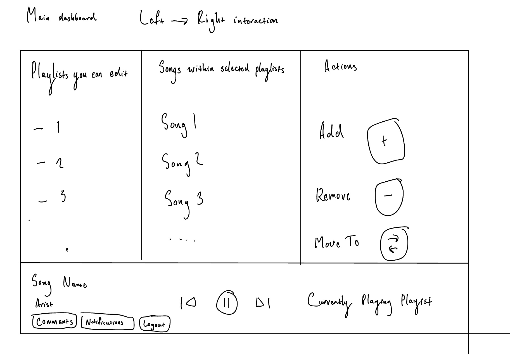

# Spotify Wheel UI 

## Login Page

Above we have our login page for our application that mimics the spotify color theme.

## Main Dashboard

The main purpose of our application is to make building and interacting with spotify playlists easier. The work-flow we present is while the user listens to music they can select a playlist to activley be editing. With the songs the user listens to they have three options to
manipulate this active playlist (add, remove, move-to). 

Our UI enables this functionality by having the user follow steps from left to right. We first have the user choose from a list of playlists
they can edit from. After they select a playlist, the songs associated with that playlist are displayed within ceneter column. From there 
the user can select which action they want to take manipulate the playlist. There is also a comments button within the bottom left corner that will open a new page that has the comments associated with that song and gives the user an oppurtunity to view what other peoples opinons on the currently playing song.

## Comments Page
